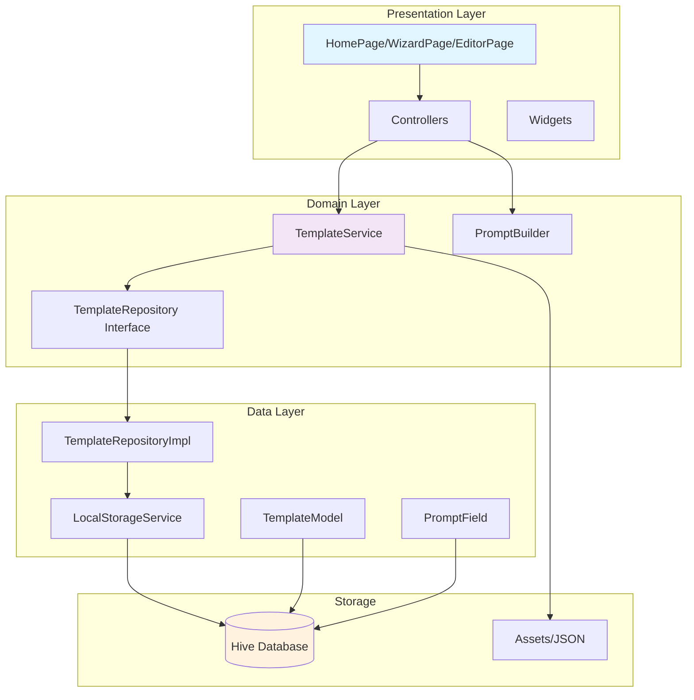

# Prompt-Forge Flutter MVP - Complete Implementation

## Project Structure

```
lib/
├── main.dart
├── app/
│   ├── routes/
│   │   └── app_routes.dart
│   ├── themes/
│   │   └── app_themes.dart
│   └── bindings/
│       └── initial_bindings.dart
├── core/
│   ├── constants/
│   │   └── app_constants.dart
│   ├── utils/
│   │   └── string_utils.dart
│   └── widgets/
│       ├── custom_app_bar.dart
│       └── loading_widget.dart
├── data/
│   ├── models/
│   │   ├── template_model.dart
│   │   └── prompt_field.dart
│   ├── repositories/
│   │   └── template_repository_impl.dart
│   └── datasources/
│       └── local_storage_service.dart
├── domain/
│   ├── entities/
│   │   ├── template.dart
│   │   └── field.dart
│   ├── repositories/
│   │   └── template_repository.dart
│   └── services/
│       ├── template_service.dart
│       └── prompt_builder.dart
└── presentation/
    ├── controllers/
    │   ├── home_controller.dart
    │   ├── editor_controller.dart
    │   └── wizard_controller.dart
    ├── pages/
    │   ├── home/
    │   │   └── home_page.dart
    │   ├── editor/
    │   │   └── template_editor_page.dart
    │   ├── wizard/
    │   │   └── prompt_wizard_page.dart
    │   └── viewer/
    │       └── result_viewer_page.dart
    └── widgets/
        ├── template_card.dart
        ├── field_input_widget.dart
        └── syntax_highlighter.dart

test/
├── unit/
│   ├── services/
│   │   ├── template_service_test.dart
│   │   └── prompt_builder_test.dart
│   └── controllers/
│       └── home_controller_test.dart
└── widget/
    └── template_card_test.dart

assets/
└── templates/
    ├── flutter_app.json
    ├── email_polisher.json
    └── star_interview.json
```

## Dependencies Configuration

```yaml
# pubspec.yaml
name: prompt_forge
description: A local-only prompt template builder for career boosting
publish_to: 'none'
version: 1.0.0+1

environment:
  sdk: '>=3.0.0 <4.0.0'
  flutter: ">=3.22.0"

dependencies:
  flutter:
    sdk: flutter
  
  # State Management & Dependency Injection
  get: ^4.6.6
  
  # Local Storage
  hive: ^2.2.3
  hive_flutter: ^1.1.0
  
  # Utilities
  path_provider: ^2.1.1
  share_plus: ^7.2.1
  flutter_syntax_view: ^4.0.0
  
  # UI Enhancement
  flutter_staggered_animations: ^1.1.1
  flutter_slidable: ^3.0.1

dev_dependencies:
  flutter_test:
    sdk: flutter
  flutter_lints: ^3.0.0
  
  # Code Generation
  hive_generator: ^2.0.1
  build_runner: ^2.4.7
  
  # Testing
  mocktail: ^1.0.1

flutter:
  uses-material-design: true
  assets:
    - assets/templates/
```

## Core Data Models

```dart

```

```dart

```

## Business Logic Services

```dart

```

```dart
// lib/domain/services/prompt_builder.dart

```

## State Management Controllers

```dart

```

```dart

```

## User Interface Components

```dart

```

```dart

```

```dart

```

## Example Template Data

```json

```

```json
// assets/templates/email_polisher.json

```

```json
// assets/templates/star_interview.json

```

## Core Utilities and Services

```dart

```

## Main App Setup

```dart

```

```dart

```

## Testing Suite

```dart

```

```dart

```

## Architecture Diagram



## Next Iteration Roadmap

### Phase 1: Core Enhancements
- **Template Editor**: Complete WYSIWYG template creation interface
- **Advanced Validation**: Regex patterns, custom validators, conditional fields
- **Improved Search**: Tags, categories, full-text search with highlighting
- **Bulk Operations**: Multi-select, batch delete, bulk export

### Phase 2: User Experience
- **Onboarding**: Tutorial wizard for first-time users
- **Themes**: Custom color schemes, font size preferences
- **Accessibility**: Screen reader support, high contrast mode
- **Animations**: Smooth transitions, loading states, micro-interactions

### Phase 3: Advanced Features
- **Template Versioning**: History tracking, rollback capabilities
- **Field Dependencies**: Conditional field visibility based on other inputs
- **Rich Text Support**: Markdown rendering, syntax highlighting
- **Template Sharing**: QR codes, deep links for sharing templates

### Phase 4: Integration & Export
- **Cloud Sync**: Optional backup to user's cloud storage
- **API Integration**: Connect to popular LLM services (GPT, Claude, etc.)
- **Export Options**: PDF, Word, plain text with formatting
- **Workflow Automation**: Chain multiple templates together

### Phase 5: Intelligence
- **Smart Suggestions**: AI-powered field suggestions
- **Template Analytics**: Usage statistics, popular templates
- **Auto-completion**: Smart suggestions based on previous inputs
- **Template Optimization**: Analyze and suggest improvements

### Technical Debt & Performance
- **Code Generation**: Automated Hive adapter generation
- **Testing**: Increase coverage to 90%+, integration tests
- **Performance**: Lazy loading, virtualized lists for large datasets
- **Documentation**: API docs, user manual, developer guide